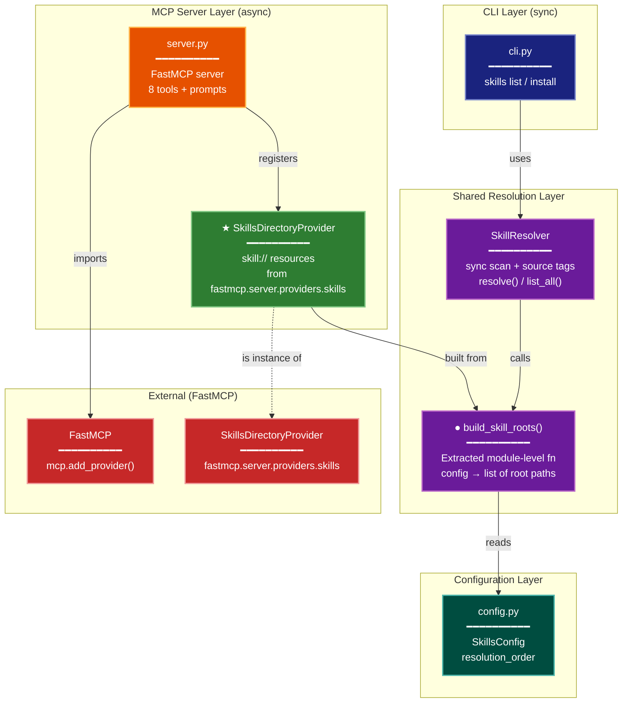
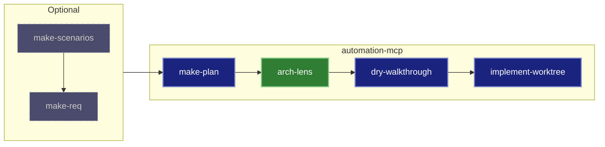

{: .post-cat-sticker }

Agentic coding makes software development fast. Too fast, yet not fast enough. Your own software's development becomes a blur to you. You find yourself constantly querying agents about your own codebase as you approve the AI generated plans. Recently, between improvements in agentic AI and my own experience using them, I have found very few errors or issues in my agentic workflows. The weak link used to be the agentic coder, now it's me. I am slogged with plans to review while trying to track & guide the development of my projects. I can't handle more walls of text.

### My current workflow

Claude Code is a tool that lets AI write, modify, and run code for you. It supports skills, which are markdown files with specific instructions that tell the AI how to perform a task. Think of them as recipes for an AI worker. You give it a recipe, it follows the steps.

My typical workflow:
```
                                    ┌──────────────────────────────────────────────────┐
(optional)          (optional)      │              Core Pipeline                       │
make-scenarios ──→ make-req ──────→ │ make-plan → dry-walkthrough → implement-worktree │
                        ↑           └──────────────────────────────────────────────────┘
                  or use directly
```

_I get dozens of plans like this every day that I have to review. My eyes are bleeding..._

{: .shadow }

### I want to see, not read

When I review a plan before running the implementation, I don't need to know every detail. My role is to guide toward an outcome, not an implementation. Testing infrastructure, reviews, linting, CI/CD workflows, and specialized agents catch most of the riffraff.

If I could see a visualization of the proposed changes, even if I miss the details, as I review dozens of these plans a day, I will internalize the architecture progression of my project.

So how do we visualize code? There are many ways to visualize a codebase, each from a different perspective (security, networking, the user, interfaces, modular, etc.). This sounds like a deep research question for Gemini. And it was. I used Gemini's deep research to explore the different strategies and philosophies around software visualization, then had Claude generate a skill for each category it identified.

### The 13 perspectives (lenses) of a codebase
[Architectural skills](https://github.com/Trecek/useful-claude-skills/tree/main/docs/arch-lens)

| Skill | Lens | Question It Answers |
| --- | --- | --- |
| [`arch-lens-c4-container`](https://github.com/Trecek/useful-claude-skills/tree/main/.claude/skills/arch-lens-c4-container/SKILL.md) | C4 Container | How is it built? |
| [`arch-lens-process-flow`](https://github.com/Trecek/useful-claude-skills/tree/main/.claude/skills/arch-lens-process-flow/SKILL.md) | Process Flow | How does it behave? |
| [`arch-lens-data-lineage`](https://github.com/Trecek/useful-claude-skills/tree/main/.claude/skills/arch-lens-data-lineage/SKILL.md) | Data Lineage | Where is the data? |
| [`arch-lens-module-dependency`](https://github.com/Trecek/useful-claude-skills/tree/main/.claude/skills/arch-lens-module-dependency/SKILL.md) | Module Dependency | How are modules coupled? |
| [`arch-lens-concurrency`](https://github.com/Trecek/useful-claude-skills/tree/main/.claude/skills/arch-lens-concurrency/SKILL.md) | Concurrency | How does parallelism work? |
| [`arch-lens-error-resilience`](https://github.com/Trecek/useful-claude-skills/tree/main/.claude/skills/arch-lens-error-resilience/SKILL.md) | Error/Resilience | How are failures handled? |
| [`arch-lens-repository-access`](https://github.com/Trecek/useful-claude-skills/tree/main/.claude/skills/arch-lens-repository-access/SKILL.md) | Repository Access | How is data accessed? |
| [`arch-lens-operational`](https://github.com/Trecek/useful-claude-skills/tree/main/.claude/skills/arch-lens-operational/SKILL.md) | Operational | How is it run and monitored? |
| [`arch-lens-security`](https://github.com/Trecek/useful-claude-skills/tree/main/.claude/skills/arch-lens-security/SKILL.md) | Security | Where are the trust boundaries? |
| [`arch-lens-development`](https://github.com/Trecek/useful-claude-skills/tree/main/.claude/skills/arch-lens-development/SKILL.md) | Development | How is it built and tested? |
| [`arch-lens-scenarios`](https://github.com/Trecek/useful-claude-skills/tree/main/.claude/skills/arch-lens-scenarios/SKILL.md) | Scenarios | Do the components work together? |
| [`arch-lens-state-lifecycle`](https://github.com/Trecek/useful-claude-skills/tree/main/.claude/skills/arch-lens-state-lifecycle/SKILL.md) | State Lifecycle | How is state corruption prevented? |
| [`arch-lens-deployment`](https://github.com/Trecek/useful-claude-skills/tree/main/.claude/skills/arch-lens-deployment) | Deployment | Where does it run? |

### Staying in the IDE

Okay so I have a bunch of lenses for visualizing code in various ways. What are we visualizing with? Well, I am not a fan of having to leave my code to work with my code. So I need my visualization to stay within my IDE (VSCode). I am not even a fan of having to leave the exact document I'm reviewing. So obviously we want a [Mermaid](https://mermaid.ai/) plot. Not those mermaids. Mermaid plots are a versatile plotting library you can embed directly into your markdown files and they will render with the markdown file.

### What it looks like

Here's an example. This diagram was produced by an agent running a skill I use for making plans. That planning skill loads a diagramming skill with the lens it thinks is most relevant to the proposed changes. If the agent thinks an additional lens view is needed it will add it too.

**Lens Used:** Module Dependency. This plan restructures import relationships by extracting shared logic and adding a new provider dependency. 



**Color Legend:**

| Color | Category | Description |
|-------|----------|-------------|
| Dark Blue | CLI | Command-line entry points |
| Orange | Server | MCP server (existing) |
| Green | New | SkillsDirectoryProvider integration |
| Purple | Resolution | Skill root building and resolution |
| Teal | Config | Configuration layer |
| Red | External | FastMCP framework |

The dot on the box means it is an existing component that will be modified by the proposed plan.  
A star on the box means it is a new component being created by the proposed plan.

### A better substrate

These architectural lenses help identify what parts of your architecture are being worked with. They also serve also as an easier substrate to communicate over with the agent. For example now I can ask, is "External (FastMCP)" actually external? Is this not a locally served MCP (It is)? Without the diagram, the plan has nothing in it that would have prompted this question.

These skills are another example of decomposing processes into specialized roles, and extending those roles to be a re-usable toolkit by other roles.

You can find more lens examples [here](https://github.com/Trecek/useful-claude-skills/tree/main/docs/arch-lens)

### My current workflow


